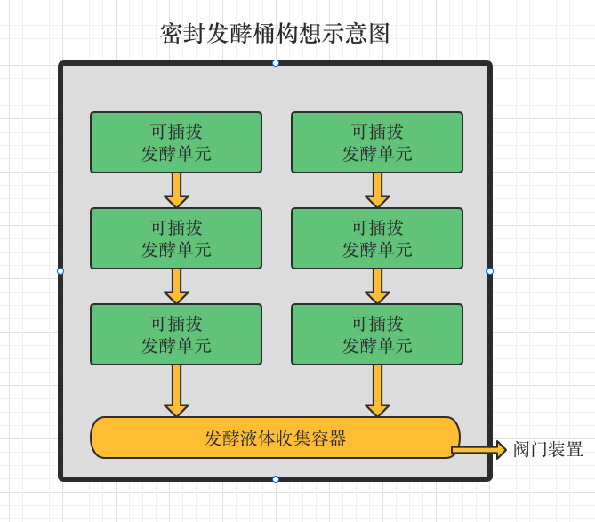

# dream-project

## 背景

    希望来城市的父母，在帮忙照顾小孩的同时，可以生活的自在和有意义些，经过摸索，发现将日常生活中产生的有机垃圾密封发酵，然后用做种植蔬菜的肥料，是比较应时应景的事（一方面大大减少了自己每天的垃圾产出，另一方面也响应了国家环保生活的号召），但是在[实践](my-practical/楼顶阳台发酵种植.md)了市面上的发酵工具后，发现使用过程中都有些不足，曾尝试联系过一家发酵桶的生产厂商，提出些改进建议，无果（也可以理解，传统制造厂商改进产品流程本来就冗长，而且这个产品应该也属于小众）。随着逐渐成熟的3D打印技术，我觉得利用在得到app中的有缘人的共同协作，是有机会打磨出一款好用的发酵工具，作为一名IT从业者（也是得到app的重度用户），我就创建了这个开源项目，希望这颗种子可以发芽，生长。

## 目的

    做为一个外行者，对于设计和制造都是小白，只是根据目前自己实际使用发酵桶的经验总结出来的一些想法，希望借助得到app的平台，找到专业人士可以协助共创出一个可以供家庭方便使用的密封发酵桶，为这个浩瀚宇宙中的蓝色星球贡献自己的一点微薄之力。

## 产品设计（迭代中）

### 设计要点

1. 发酵桶整体保证密封性的同时要兼顾开合的便利性。
   备注：因为每天会产生厨余垃圾，每天可能需要打开和关闭发酵桶多次。
2. 发酵单元底部采用网状，用来排出发酵产生的液体
   备注：考虑到可插拔的原因是新加入的垃圾可以方便利用发酵桶中已有的菌种，这样就可以循坏利用菌种，发酵开始后就无需再考虑额外购买菌种的成本，减少使用者的成本

### 设计示意图

图示说明：

- 图中的黄色箭头只是表示发酵产生液体的流向，并不表示某种装置
- 可插拔发酵单元我目前想到的就是类似抽屉的一个容器，只不过容器底部可以排水

### 未来版本考虑的因素

1. 发酵桶整个外壳的保温性能
   备注：因为冬天温度低发酵比较慢，如果保温效果好，发酵效果会比较好

## 写在后面

    前一段时间，工作上有点压力，翻看到之前买的王潇书《五种时间》，内心中的某些种子再次被激活，当在自己的葬礼上，讲诉自己这一生时，你会如何描述？这个问题可以让你看清很多。希望在自己的工作之余能做些对保护地球有价值的事情，弥补稍许人类对这颗蓝色星球的摧残。

触发我行动的最后一根稻草，是再次听到罗胖说到一位父亲为了给儿子看病，自己研制药物的事迹。

感谢生命中的一些遇见，他们也许都曾经悄悄的种下了种子（得到的跨年演讲，得到app的武志红心理学课，孙瑞雪的《爱和自由》，李一诺推荐的《臣服实验》，刘丰老师喜马拉雅的演讲等，无法），在你不经意间这些种子就发芽成长，所以我也努力种好自己的种子。
