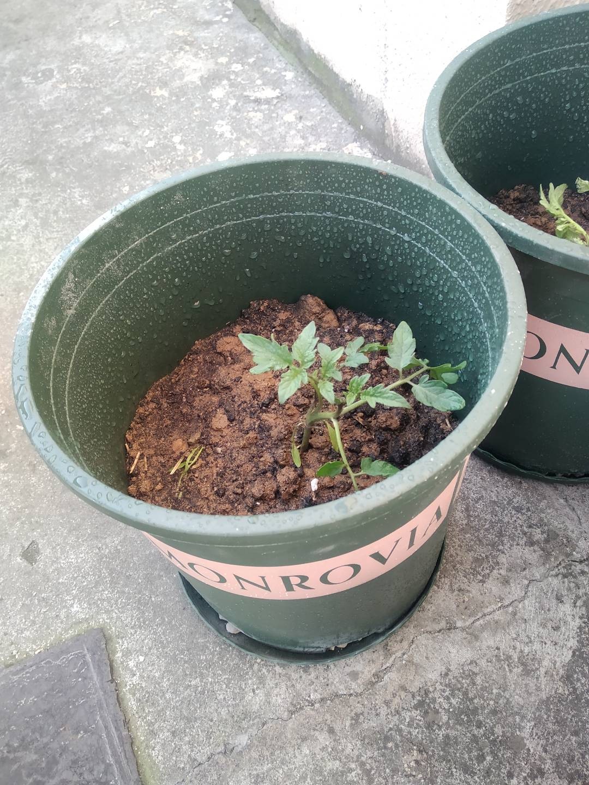

# 采用发酵工具

# 总结

1. 桶满后，更换不太方便，并且装新的厨余垃圾后，还要再加发酵菌种
2. 发酵产生的液态肥需要手动收集，有时，一次需要等待7，8分钟，不太方便
3. 每天倒厨余垃圾时，桶盖的打开和关闭还是不太方便（如果做成类似冰箱的开合感觉会比较方便）

# 充满生命力的小青菜

## 播种

## 成长

## 收获

# 不太成功的西红柿

## 播种

## 成长

## 收获

# 不速之客

家里的阳台某日来了位不速之客

